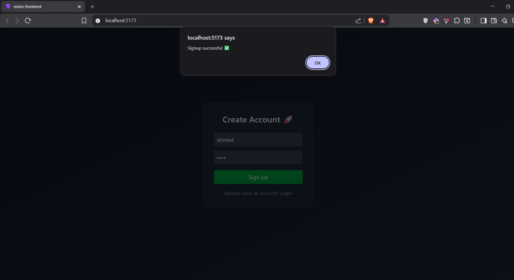
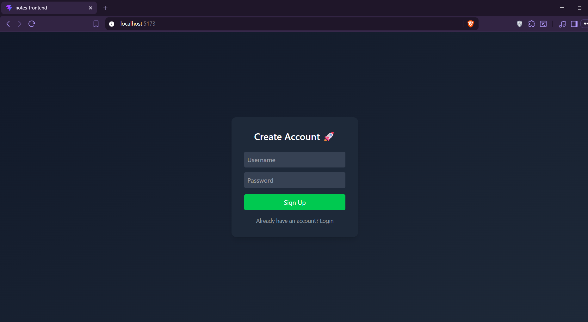
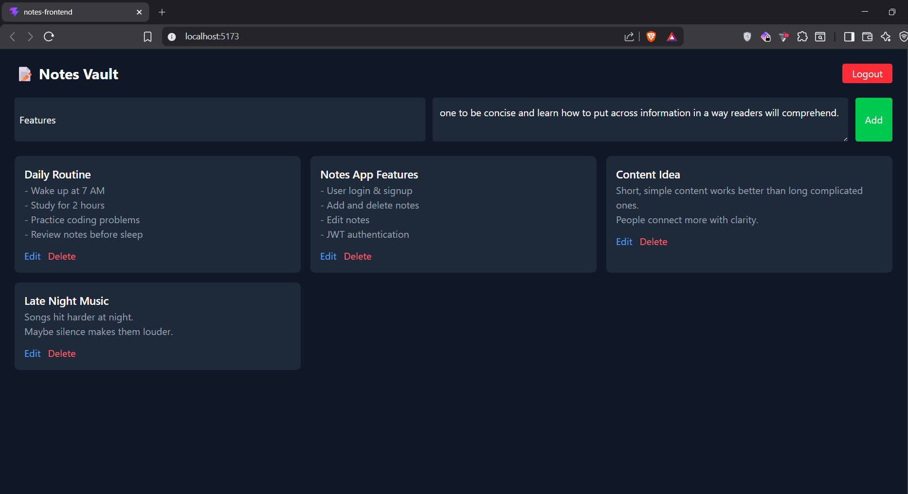
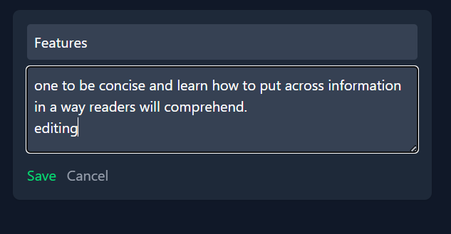
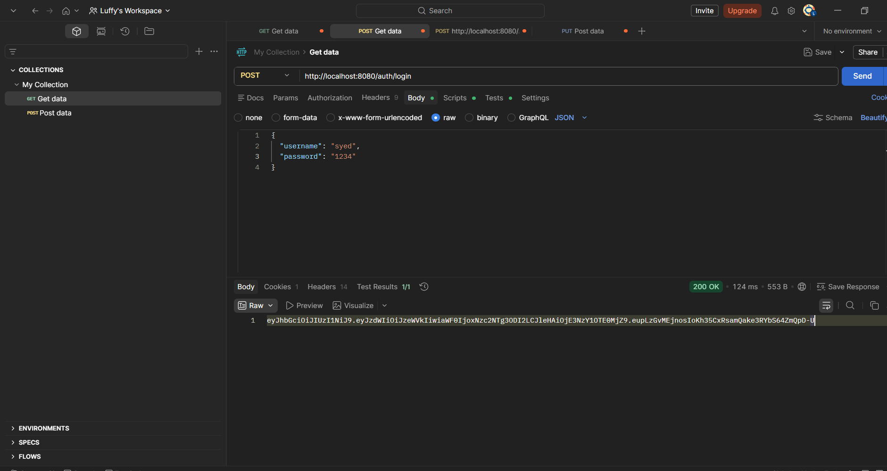
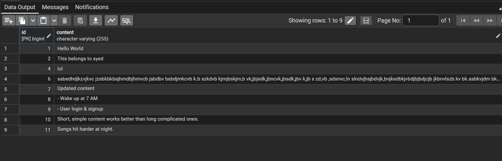

# 📝 Notes Vault App

A full-stack Notes application that allows users to securely create, manage, and organize their notes from anywhere.

---

## 🚀 Features

* 🔐 User Authentication (Signup & Login)
* 🔑 JWT-based Authorization
* 📝 Create, Read, Update, Delete Notes (CRUD)
* 👥 User-specific notes (data isolation)
* 🎨 Clean and responsive UI (React + Tailwind CSS)
* 🗄️ PostgreSQL database integration
* ⚡ REST API built with Spring Boot

---

## 🛠️ Tech Stack

### 💻 Frontend

* React (Vite)
* Tailwind CSS

### ⚙️ Backend

* Spring Boot
* Spring Security
* JWT Authentication

### 🗄️ Database

* PostgreSQL (Local)

---

## 📸 Screenshots

### 🔐 Login Page



### 🆕 Signup Page



### 📝 Dashboard (Notes View)



### ✏️ Edit Note



### 🔐 Authentication (Postman - JWT Token)



### 🗄️ Database (PostgreSQL Table)



---

## 📂 Project Structure

```
notes-app/
├── notes-backend/     # Spring Boot Backend
├── notes-frontend/    # React Frontend
└── screenshots/       # App Screenshots
```

---

## ⚙️ How to Run Locally

### 🔧 1. Clone the Repository

```
git clone https://github.com/syedahmedw/notes-app.git
cd notes-app
```

---

### 🖥️ 2. Run Backend (Spring Boot)

```
cd notes-backend
.\mvnw spring-boot:run
```

👉 Backend runs on:

```
http://localhost:8080
```

---

### 🌐 3. Run Frontend (React)

```
cd ../notes-frontend
npm install
npm run dev
```

👉 Frontend runs on:

```
http://localhost:5173
```

---

## 🗄️ Database Setup (PostgreSQL)

1. Install PostgreSQL
2. Create database:

```
CREATE DATABASE notesdb;
```

3. Update `application.properties`:

```
spring.datasource.url=jdbc:postgresql://localhost:5432/notesdb
spring.datasource.username=postgres
spring.datasource.password=yourpassword

spring.jpa.hibernate.ddl-auto=update
```

---

## 🔐 API Endpoints

### Auth

* `POST /auth/signup`
* `POST /auth/login`

### Notes

* `GET /notes`
* `POST /notes`
* `PUT /notes/{id}`
* `DELETE /notes/{id}`

---

## 🧪 Demo Credentials

```
Username: testuser  
Password: 1234
```

---

## 🧠 What I Learned

* Building REST APIs using Spring Boot
* Implementing JWT Authentication
* Securing endpoints with Spring Security
* Managing state in React
* Connecting frontend with backend APIs
* Working with PostgreSQL database
* Structuring full-stack applications

---

## 📌 Future Improvements

* 🔍 Search & filter notes
* 🕒 Add timestamps
* 📱 Mobile UI improvements
* ☁️ Deployment (backend + frontend)
* 🎨 UI enhancements (Notion-style)

---

## 🙌 Acknowledgements

This project was built as part of learning full-stack development and understanding real-world application architecture.

---

## ⭐ If you like this project

Give it a star ⭐ on GitHub!
